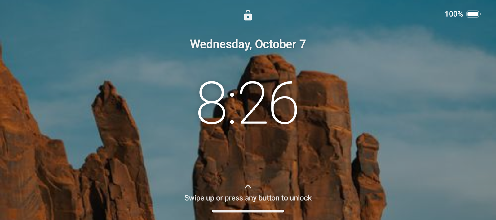
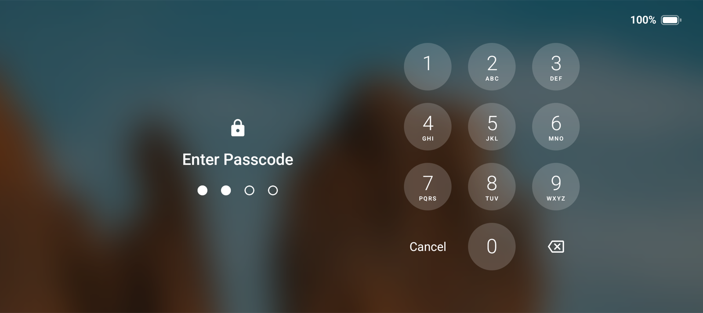
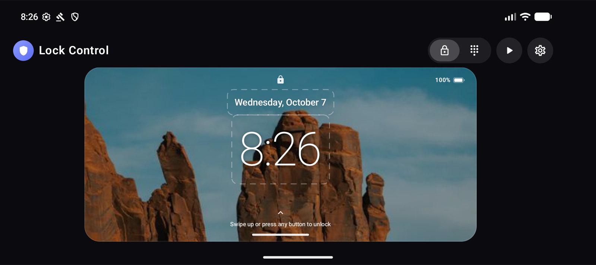
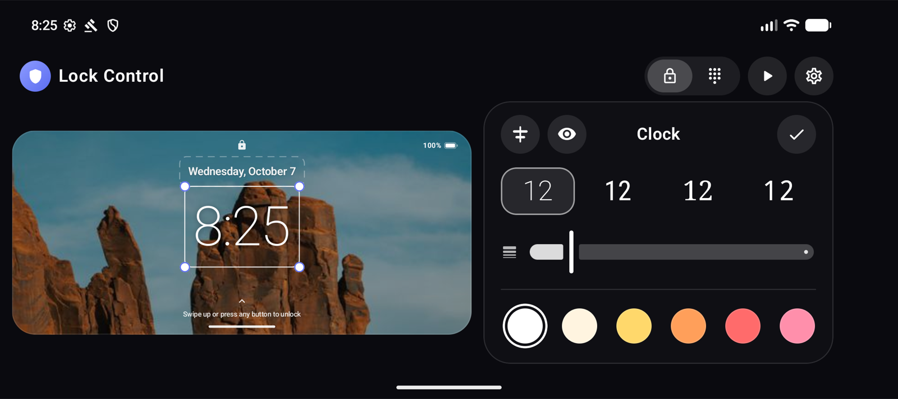
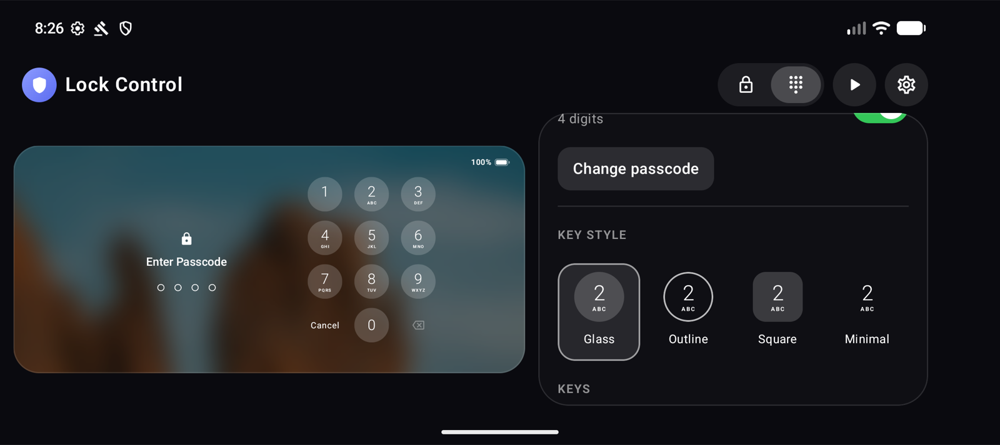
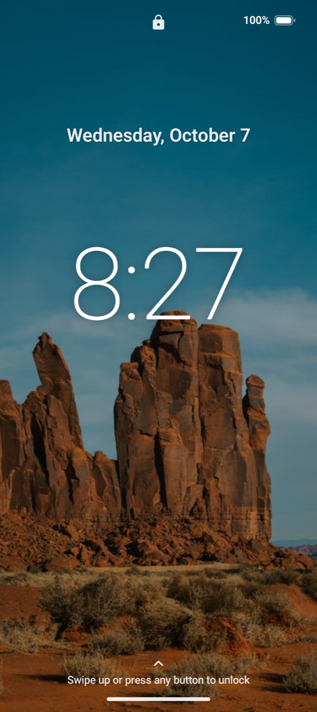
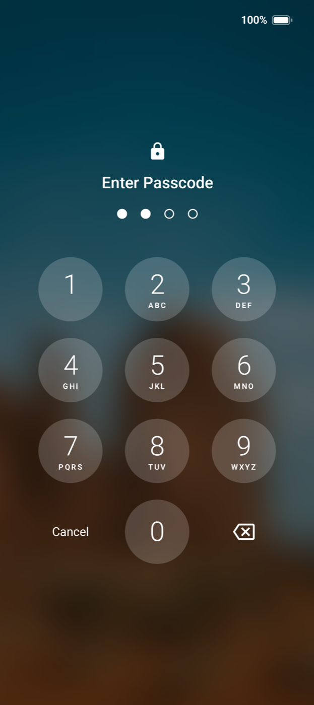
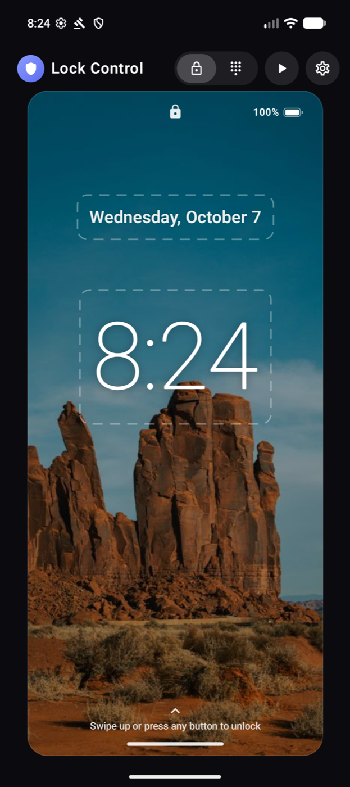
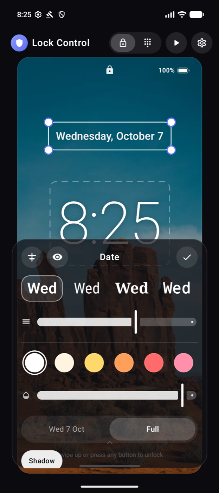

# Lock Control

**A lock screen you actually designed.**

Some devices come with a lock screen you can't change, like the giant clock on the AYN Odin 2 Portal. Lock Control replaces it with one you design yourself: your own photo or a looping video, a clock and date placed exactly where you want them, and a beautiful passcode pad inspired by iOS.

Made for handhelds like the **AYN Odin 2 Portal**, and works on any device with Android 12 or later.

  
  

## Why you'll like it

* **Your wallpaper, even video.** Use a photo or an mp4 that loops silently in the background. Pinch to zoom and drag to frame it just right.
* **Put the clock anywhere.** Drag the clock and date wherever you like, and pull the corners to make them bigger, taller or wider.
* **Fonts and colors you choose.** Pick a typeface and thickness, any color, and how see-through it should be. The clock, date and every bit of text can be styled on its own.
* **A passcode pad you'll enjoy using.** Frosted round keys in four styles, your colors, and a soft blur of your wallpaper behind them.
* **Edit by tapping.** Tap anything on the preview to customize it. What you see is exactly what you get.
* **Made for handhelds.** Works great in landscape and portrait, and you can type your passcode with the D-pad and buttons.
* **Private by design.** No internet, no tracking, and it never reads what's on your screen.

## Design it your way

Everything happens on a full-screen preview. Tap the clock, the date, the background or the passcode keys, and a panel opens with just the options for that piece.

  

  
  

It looks just as good held upright.

  
  
  
  

## How it works

When your screen turns off, Lock Control puts your lock screen in place, so it's already there the moment you wake your device. Swipe up or press any button, enter your passcode, and you're in.

Android doesn't let apps restyle the built-in lock screen, so Lock Control replaces it instead. You switch the system screen lock off, and Lock Control becomes your lock screen, with its own passcode.

## Get started

1. Install Lock Control on your device.
2. Open it, tap the **keypad** icon at the top, tap any key and turn on **Use passcode**.
3. Tap the **gear** icon and follow **Finish setup** to turn on the **Lock Control lock screen** service.
4. In your device settings, go to **Security → Screen lock** and choose **None**.
5. Press the power button twice. Say hello to your new lock screen.

That's it. Everything else (backgrounds, clock, date, text and keys) you can change anytime from the preview.

## Good to know

* **Your passcode is Lock Control's own.** Apps can't read your device passcode, so you set one inside Lock Control. Using the same digits as before is perfectly fine.
* **On Android 13, the setup switch might be greyed out** for apps installed outside the Play Store. Open **App info → ⋮ → Allow restricted settings**, then try again.
* **Locked out?** Restarting in Safe Mode turns Lock Control off, so you can always get back in.

---

Lock Control is a personal project, built to be installed directly rather than through the Play Store. To build it yourself, run `./gradlew :app:installDebug` with your device connected.
